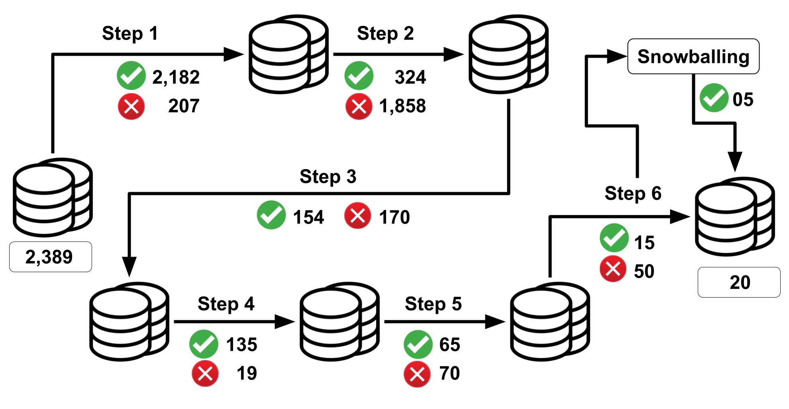

This webpage containing the data of the Empirical Study and Systematic Literature Review conduct.

### Abstract

Refactoring aims to remove bad smells and increase software systems' maintainability by improving their structure without changing their behavior. Even with tools to assist refactoring, many developers do not trust their solutions, claiming that some studies show that refactoring can introduce new bad smells into the source code. However, we have not found a complete catalog that states when this may occur. To investigate this subject deeply, the goal of this dissertation is to evaluate the effects of refactoring on bad smells. Specifically, we want to know if and what refactoring removes bad smells or introduces them. To achieve this goal, we conducted a Systematic Literature Review (SLR) to identify the relationship between refactorings and Fowler's bad smells. We also conducted an Empirical Study with five refactorings to analyze their effects on ten bad smells with five tools. As a result of the empirical study, we present, through the data studied, which bad smells tend to be removed or introduced by the automated refactoring process. In SLR, we found 20 different papers showing the direct relationship between 31 refactorings and 16 bad smells. We produced a catalog showing these relationships, and we also showed a contrast with Fowler's relationships. We identified that the most discussed relationship in the literature is between Move Method and Feature Envy. SLR also revealed different refactoring strategies than those discussed by Fowler for dealing with bad smells. In the empirical study, we observed refactoring generated decrease, increase, and neutral variations in the number of bad smells. Unlike Fowler's definition, we surprisingly found that the decrease cases was the lowest compared to cases of increase and neutral variations. As one of the additional analyzes, we contrast the results found in both studies carried out.

**Keywords** Refactoring, Bad Smell, Refactoring Impacts, Refactoring Effects

### Systemac Literature Review

#### Filtering Databases

| Database            | Step 1 | Step 2 | Step 3 | Step 4 | Step 5 | Step 6 |
|:--------------------|:--------:|:--------:|:--------:|:--------:|:--------:|:--------:|
| ACM Digital Library | 97 | 68  | 33 | 25 | 12 | 03 |
| Engineering Village | 20 | 13  | 06 | 04 | 03 | 03 |
| IEEE Xplore         | 28 | 18  | 12 | 05 | 02 | 00 |
| Science Direct      | 02 | 02  | 01 | 01 | 01 | 00 |
| Scopus              | 17 | 11  | 06 | 04 | 03 | 01 |
| Springer            | 2,016 | 210  | 95 | 95 | 43 | 08 |
| Web of Science      | 02 | 02  | 01 | 01 | 01 | 00 |

* Step 1 - Remove Duplicates
* Step 2 - Reading Title
* Step 3 - Reading Abstract
* Step 4 - Inclusion and Exclusion Criteria
* Step 5 - Reading Introduction and Conclusion
* Step 6 - Complete Reading of Paper

#### Files

* [Evaluate Papers](file/Evaluate Data.xlsx)
* [Extract Data Papers](file/Extract Data.xlsx)

#### Places of Publication

| Place            | Total |
|:-----------------|:------:|
| Book Chapter     | 01 |
| Conference       | 08 |
| Journal          | 09 |
| Symposium        | 02 |

#### Events

| Event                                                                             | Total |
|:----------------------------------------------------------------------------------|:------:|
| Frontiers of Computer Science                                                     | 01 |
| IEEE Transactions on Software Engineering	                                        | 03 |
| Innovations Syst Softw Eng                                                        | 01 |
| International Conference on Agile Software Development (XP)	                      | 02 |
| International Conference on Enterprise Information Systems (ICEIS)              	| 01 |
| International Conference on Product Focused Software Process Improvement (PROFES)	| 01 |
| International Conference on Software Analysis, Evolution, and Reengineering	      | 01 |
| International Conference on Software Quality (SWQD)                             	| 01 |
| International Journal of System Assurance Engineering and Management            	| 01 |
| International Symposium on Empirical Software Engineering                       	| 01 |
| Joint Meeting on Foundations of Software Engineering	                            | 01 |
| Journal of Software: Practice and Experience	                                    | 01 |
| Journal of Systems and Software                                                 	| 01 |
| Recommendation Systems in Software Engineering	                                  | 01 |
| Requirements Eng                                                                	| 01 |
| Simpósio Brasileiro de Engenharia de Software (SBES)	                            | 01 |
| Working Conference on Reverse Engineering (WCRE)                          	      | 01 |

#### Tools found in the Literature

| Tool | Refactoring Tool Used | Bad Smell Tool Used | Reference |
|:-----|:----------------------|:--------------------|:----------:|
| DCRA   | Integrated          | NiCad                | [1]      |
| RESYS | OSORE                | OCEAN               | [2]       |
|        | Ref-Finder          | Own Metric Developed | [3]      |
|        | JDeodorant          | JDeodorant and DECOR | [4]      |
|        | JDeodorant          | JDeodorant           | [6]      |
| Extract Method Detector | Integrated | Integrated   | [9]      |
| Methodbook | Integrated      | Integrated           | [10]      |
| MMRUC3 | Integrated          | Integrated          | [11]       |
|       | ARIES and JDeodorant | JDeodorant           | [12]      |
| CCShaper | Integrated          | CCFinder             | [13]      |
|        | Refactoring Miner   | Own Metric Developed | [15]      |
|  | Ref-Detector               | Metrics to Detect Smell | [16] |
| Liu's Approach | Integrated    | Integrated         | [17]      |
| Tsantalis's Methodology  | Integrated  | Integrated | [18]      |
| HIST   |                     | Integrated           | [19]      |
| JMove    | Integrated      | Integrated             | [20]      |

#### List of Papers

##### Filtering Steps

[1] A Duplicated Code Refactoring Advisor

[2] An Approach for Semantically-Enriched Recommendation of Refactorings Based on the Incidence of Code Smells

[3] An Experimental Investigation on the Innate Relationship Between Quality and Refactoring

[4] Analysis of Code Smell to Quantify the Refactoring

[5] Common Refactorings, a Dependency Graph and some Code Smells: An Empirical Study of Java OSS

[6] Investigating the Evolution of Code Smells in Object-Oriented Systems

[7] Learning to Rank Extract Method Refactoring Suggestions for Long Methods

[8] Leveraging Code Smell Detection with Inter-smell Relations

[9] Major Motivations for Extract Method Refactorings: Analysis Based on Interviews and Change Histories

[10] Methodbook: Recommending Move Method Refactorings via Relational Topic Models

[11] MMRUC3: A Recommendation Approach of Move Method Refactoring Using Coupling, Cohesion, and Contextual Similarity to Enhance Software Design

[12] Recommending Refactoring Operations in Large Software Systems

[13] Refactoring Support Based on Code Clone Analysis

[14] Supporting Requirements to Code Traceability Through Refactoring

[15] Understanding the Impact of Refactoring on Smells: A Longitudinal Study of 23 Software Projects

##### Snowballing

[16] Does Refactoring Improve Software Structural Quality? A Longitudinal Study of 25 Projects

[17] Domino Effect: Move More Methods Once a Method is Moved

[18] Identification of Move Method Refactoring Opportunities

[19] Mining Version Histories for Detecting Code Smells

[20] Recommending Move Method Refactorings Using Dependency Sets

### Empirical Study

### Publications

- Silva, Cleiton; Santana, A.; Figueiredo, Eduardo ; Bigonha, Mariza A. S., Revisiting the Bad Smell and Refactoring Relationship: A Systematic Literature Review. __23rd Iberoamerican Conference on Software Engineering (CIbSE), Experimental Software Engineering (ESELAW)__. Curitiba (online), Brazil, 2020. [Page Link](https://cleitonsilvat.github.io/eselaw2020/)

- Tavares, Cleiton; Bigonha, Mariza; Figueiredo, Eduardo, Analyzing the Impact of Refactoring on Bad Smells (short paper). __Proceedings of the 34th Brazilian Symposium on Software Engineering (SBES)__, pages 97-101. Natal (online), Brazil, 2020. https://doi.org/10.1145/3422392.3422408. [Page Link](https://cleitonsilvat.github.io/sbes2020/)

- Tavares, Cleiton; Bigonha, Mariza A. S.; Figueiredo, Eduardo, Quantifying the Effects of Refactorings on Bad Smells. __10th Workshop on Theses and Dissertations - Master Students (WTDSOFT)__. Natal (online), Brazil, 2020.

#### Involved People
- [Cleiton Tavares](http://labsoft.dcc.ufmg.br/doku.php?id=people:students:cleiton_silva) - cleitonsilvatavares@gmail.com - cleiton.silva@dcc.ufmg.br
- [Mariza Bigonha](https://homepages.dcc.ufmg.br/~mariza/) - mariza@dcc.ufmg.br
- [Eduardo Figueiredo](https://homepages.dcc.ufmg.br/~figueiredo/) - figueiredo@dcc.ufmg.br
